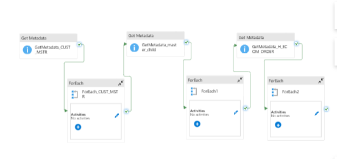
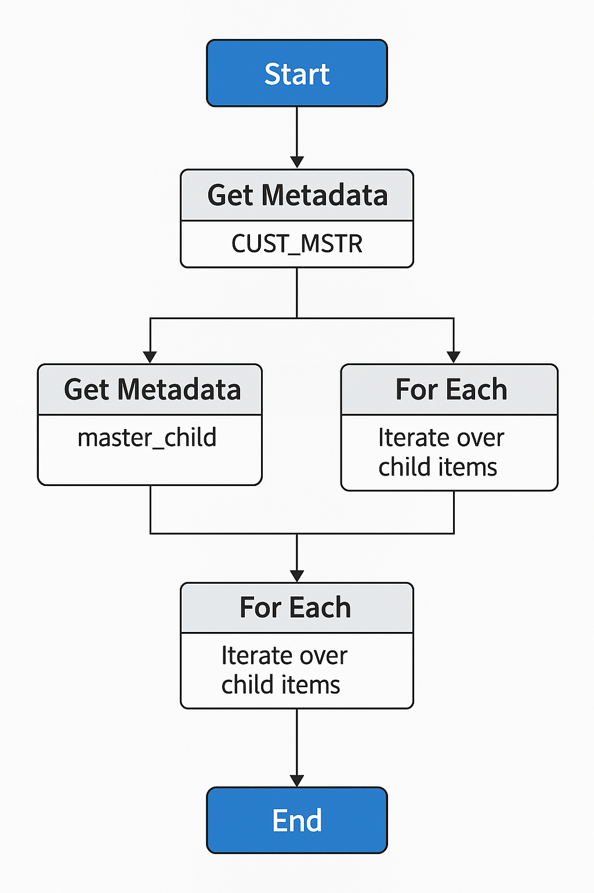
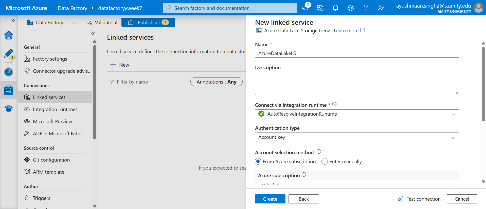
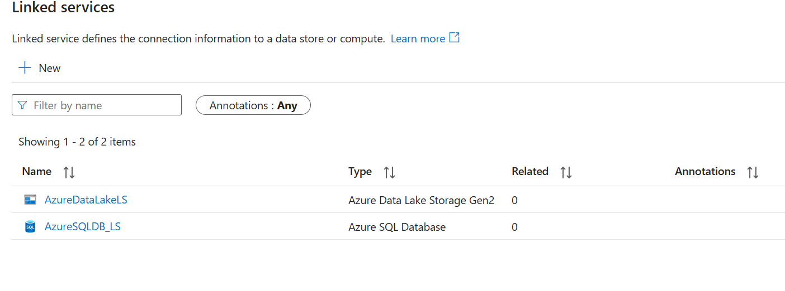
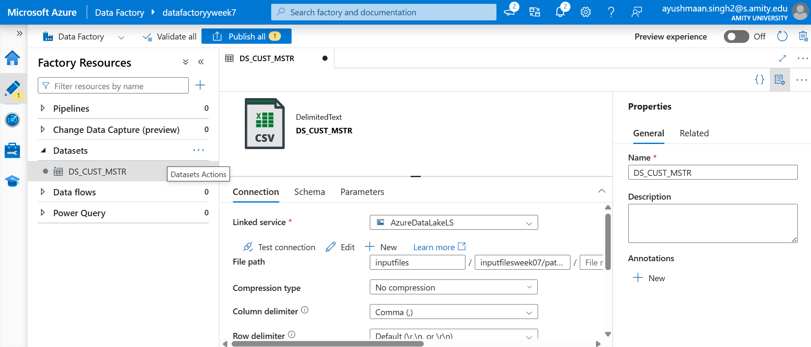
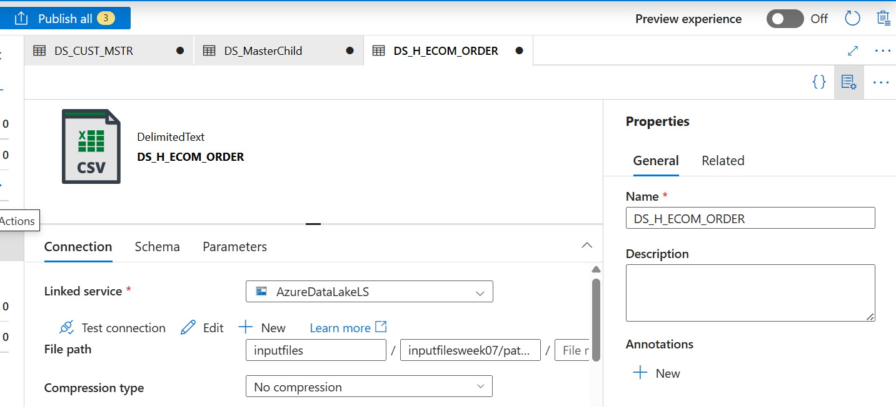
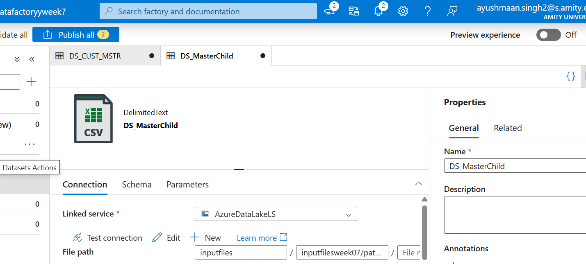
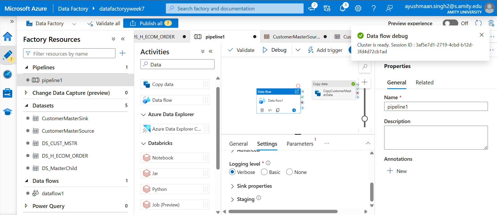

<h1 align="center">🚀 Week 7: Truncate & Load ADF Pipeline — Internship Project 🚀</h1>

<p align="center">
  
</p>

## 📌 Project Overview

In this task, I built a **Truncate and Load Azure Data Factory (ADF) pipeline** that ingests data from **3 types of CSV files** stored in Azure Data Lake Storage Gen2 (ADLS Gen2). Each file type had different transformation requirements.

I used a combination of:
- **Metadata** activities
- **ForEach** loops
- **Data Flows with Derived Columns**
- **Truncate-load logic**
- **Daily trigger automation**

> ✅ This work was completed as part of the **CSI Internship Program (Celebal Technologies)**.

---

## 🧠 Problem Statement

You're given **3 different file types** stored in ADLS Gen2, and you're required to:

| File Type               | Task                                                                                     |
|-------------------------|------------------------------------------------------------------------------------------|
| `CUST_MSTR_*.csv`       | Extract `file_date` from filename (e.g. `20191112`) → Format as `2019-11-12` → Load into `CUST_MSTR` table |
| `master_child_export-*` | Extract `file_date` (`2019-11-12`) & `date_key` (`20191112`) from filename → Load into `master_child` table |
| `H_ECOM_ORDER.csv`      | Load data **as-is** into the `H_ECOM_Orders` table                                        |

📝 Note: **Truncate the table** before loading each day.

---

## 🏗️ Azure Resources Used

* Azure Data Factory (ADF)
* Azure Data Lake Storage Gen2 (ADLS Gen2)
* Azure SQL Database (Sink)

<p align="center">
  
</p>

---

## 🔗 Linked Services

✅ Connections were established to:
- Azure SQL Database
- Azure Data Lake Gen2

<p align="center"> </p>

---

## 🗂️ Datasets

Defined datasets for:
- All three CSV sources (parameterized where needed)
- Each SQL Sink Table

<p align="center">


</p>

---

## 🔁 Pipeline Structure

<p align="center"></p>

The master pipeline consists of **3 branches**, each handling one type of file:
1. `CUST_MSTR`
2. `master_child_export`
3. `H_ECOM_ORDER`

Each branch follows this flow:
**Get Metadata → ForEach File → Execute Data Flow (with logic) → Load into SQL**

---

## 🔁 `CUST_MSTR` Branch

### ✅ Metadata

<p align="center"></p>

### ✅ ForEach Loop

📌 Items:
```json
@activity('GetMetadata_CUST_MSTR').output.childItems
